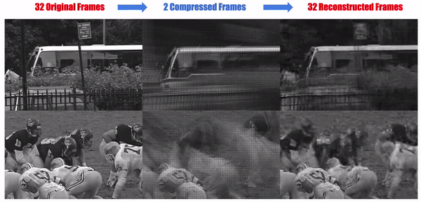

<p align="center">

</p>

<i>Video compressive sensing aims at increasing the temporal resolution of a sensor by incorporating additional hardware components to the camera architecture and employing powerful computational techniques for high speed video reconstruction. The additional components operate at higher frame rates than the camera’s native temporal resolution giving rise to low frame rate multiplexed measurements <b>(middle frames)</b> which can later be decoded to extract the unknown observed high speed video sequence <b>(right frames)</b>.</i>


# DeepVideoCS
A deep learning framework for video compressive sensing [[Paper]](https://arxiv.org/pdf/1603.04930v2.pdf) [[Project Page]](http://users.eecs.northwestern.edu/~mif365/deep_cs_project.html)

Deep Fully-Connected Networks for Video Compressive Sensing
[Michael Iliadis](http://users.eecs.northwestern.edu/~mif365/)\*, [Leonidas Spinoulas](http://ivpl.eecs.northwestern.edu/users/LSpinoulas)\*, [Aggelos K. Katsaggelos](http://ivpl.eecs.northwestern.edu/users/akatsaggelos/)
In Elsevier Digital Signal Processing, 2018.  (* equal contributions)


## Prerequisites
- Linux or MacOS
- Python 2
- NVIDIA GPU + CUDA CuDNN


## Getting Started
### Installation
- Install PyTorch and dependencies from http://pytorch.org


### Python requirements

Install all requirements below (with pip or conda)

- imageio (https://imageio.github.io/)
- h5py (http://www.h5py.org/)
- pandas (https://pandas.pydata.org/)
- bokeh (https://bokeh.pydata.org/en/latest/)


### Clone this repo
```bash
git clone https://github.com/miliadis/DeepVideoCS
cd DeepVideoCS
```

## Testing

### Download reconstructed videos

- [reconstructed_videos](https://drive.google.com/open?id=1SkyiV3JjA-BOT1F0itMxBmdWCh-iUI-H): All reconstructed videos from different algorithms


### Download testing videos

- [paper_videos](https://drive.google.com/file/d/1PGav_1Yju2lfXlXQsxnvkMPu_j_EWm0B/view?usp=sharing): 14 Videos that we tested in our paper

Put dataset folder under `download` folder


### Download pre-trained models

- [fc7](https://drive.google.com/open?id=1hT0JH5cnQmDPk_6Y1LtkZKeh5gImoOwk): Fully connected network with 7 layers
- [fc4](https://drive.google.com/open?id=1g2lP_UqUm9vXD039Cs2ey1URE-Smjgh7): Fully connected network with 4 layers

Put model under `download` folder

### Testing script

To reproduce paper's results please run the following script:

```bash
python test.py './download/papers_video' fcnet 7 './download/model_best.pth.tar' --save_videos='./output_videos' --gpu_id 0
```

If you want to reproduce results with noise use the option `'noise'`.

Here are all options:

```bash
usage: test.py [-h] [--block_opts BLOCK_OPTS [BLOCK_OPTS ...]]
               [--block_overlap] [--noise NOISE] [--mean MEAN] [--std STD]
               [--seed SEED] [--save_videos SAVE_VIDEOS]
               [--save_format SAVE_FORMAT] [--gpu_id GPU_ID]
               data arch layers_k pretrained_net

PyTorch Video Compressive Sensing - Testing

positional arguments:
  data                  path to testing dataset
  arch                  choose model name
  layers_k              number of FC layers in decoder
  pretrained_net        pre-trained model path

optional arguments:
  -h, --help            show this help message and exit
  --block_opts BLOCK_OPTS [BLOCK_OPTS ...]
                        Item order: (temporal size, spatial size, video chunks)
  --block_overlap       overlapping blocks or not
  --noise NOISE         Noise Level in dB: e.g., 20, 30, 40
  --mean MEAN           Mean file
  --std STD             Standard deviation file
  --seed SEED           random seed
  --save_videos SAVE_VIDEOS
                        path to save videos
  --save_format SAVE_FORMAT
                        format for saving video file: avi, gif
  --gpu_id GPU_ID       choose gpu id

```

## Training

### Download training videos

- [train_data](https://drive.google.com/file/d/1NyMIyp9N-UCYCobcTv7CFYd1zfXG9wJn/view?usp=sharing): 10 million video patches of size (8x8x16) - <b>41GB</b>
- [val_data](https://drive.google.com/file/d/10JcfD5TRltTOV4w0wB3cE_0zrqAx8ZxU/view?usp=sharing): Video used for validation

Extract and put train and val data under `download` folder

### Training script

To reproduce paper's results for FC7 network please run the following script:

```bash
python train.py './download/h5_data/' './download/ValVideos/' fcnet 7 --hdf5 --encoder_lr=0.0 --decoder_lr=0.01 --decoder_annual 0.1 400 --bernoulli_p=50 --save='10M_50_7_mask_non_trained' --epochs=600 --gpus 0
```

If you want to reproduce results with noise use the option `--noise=20`.

Here are all options for training script:

```bash
usage: train.py [-h] [--hdf5] [--mean MEAN] [--std STD] [--workers WORKERS]
                [--gpus GPUS [GPUS ...]] [--pretrained_net PRETRAINED_NET]
                [--mask_path MASK_PATH] [--bernoulli_p BERNOULLI_P]
                [--block_opts BLOCK_OPTS [BLOCK_OPTS ...]] [--block_overlap]
                [--noise NOISE] [--seed SEED] [--epochs EPOCHS]
                [--batch-size BATCH_SIZE] [--encoder_lr ENCODER_LR]
                [--decoder_lr DECODER_LR]
                [--encoder_annual ENCODER_ANNUAL [ENCODER_ANNUAL ...]]
                [--decoder_annual DECODER_ANNUAL [DECODER_ANNUAL ...]]
                [--gradient_clipping GRADIENT_CLIPPING] [--momentum MOMENTUM]
                [--weight-decay WEIGHT_DECAY] [--start-epoch START_EPOCH]
                [--print-freq PRINT_FREQ] [--results_dir RESULTS_DIR]
                [--save SAVE] [--resume RESUME]
                data_train data_val arch layers_k

PyTorch Video Compressive Sensing - Training

positional arguments:
  data_train            path to training dataset
  data_val              path to validation dataset
  arch                  choose model name
  layers_k              number of FC layers in decoder

optional arguments:
  -h, --help            show this help message and exit
  --hdf5
  --mean MEAN           Mean file
  --std STD             Standard deviation file
  --workers WORKERS     number of data loading workers (default: 0)
  --gpus GPUS [GPUS ...] GPUs list: e.g., 0 1
  --pretrained_net PRETRAINED_NET
                        pre-trained model path
  --mask_path MASK_PATH
                        provide a pre-defined compressive sensing mask
  --bernoulli_p BERNOULLI_P
                        percentage of 1s for creating mask
  --block_opts BLOCK_OPTS [BLOCK_OPTS ...]
                        Item order: (temporal size, spatial size, video
                        chunks)
  --block_overlap       overlapping blocks or not
  --noise NOISE         Noise Level in dB: e.g., 20, 30, 40
  --seed SEED           random seed
  --epochs EPOCHS       number of total epochs to run
  --batch-size BATCH_SIZE
                        mini-batch size (default: 200)
  --encoder_lr ENCODER_LR
                        initial learning rate for encoder
  --decoder_lr DECODER_LR
                        initial learning rate for decoder
  --encoder_annual ENCODER_ANNUAL [ENCODER_ANNUAL ...]
                        Item order: (divide by, for every # epochs, until
                        epoch #, then lr=0)
  --decoder_annual DECODER_ANNUAL [DECODER_ANNUAL ...]
                        Item order: (divide by, at epoch [#])
  --gradient_clipping GRADIENT_CLIPPING
                        gradient clipping to prevent explosion
  --momentum MOMENTUM   momentum
  --weight-decay WEIGHT_DECAY
                        weight decay (default: 0)
  --start-epoch START_EPOCH
                        manual epoch number (useful on restarts)
  --print-freq PRINT_FREQ
                        print frequency (default: 1000)
  --results_dir RESULTS_DIR
                        results dir
  --save SAVE           folder to save checkpoints
  --resume RESUME       path to latest checkpoint (default: none)

```

## Citation
If you use this code for your research, please cite our papers.
```
@article{DeepVideoCS2018,
title = "Deep fully-connected networks for video compressive sensing",
journal = "Digital Signal Processing",
volume = "72",
pages = "9 - 18",
year = "2018",
url = "http://www.sciencedirect.com/science/article/pii/S1051200417302130",
author = "Michael Iliadis and Leonidas Spinoulas and Aggelos K. Katsaggelos"}
```

## Acknowledgments
Code is inspired by [pytorch-imagenet-example](https://github.com/pytorch/examples/blob/master/imagenet/main.py), [convnets-in-pytorch](https://github.com/eladhoffer/convNet.pytorch) and [cyclegan](https://github.com/junyanz/pytorch-CycleGAN-and-pix2pix).
